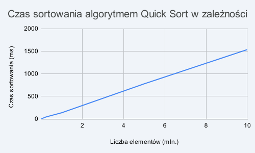

# Eksperymentalne szacowanie złożoności obliczeniowej wybranych algorytmów sortowania – Sortowanie szybkie (Quick Sort) 

**Przedmiot:** Algorytmy i złożoność   
**Autor:** Maksymilian Tym (73059)   

---

## 1. Krótki opis algorytmu 
Wybranym algorytmem do implementacji i analizy jest **Sortowanie szybkie (Quick Sort)**. Jest to bardzo wydajny algorytm sortowania oparty na paradygmacie „dziel i zwyciężaj” (ang. *divide and conquer*). Działa on poprzez wybór jednego elementu z tablicy, nazywanego elementem osiowym (*pivotem*). W zaimplementowanej wersji jako pivot zawsze wybierany jest ostatni element aktualnie przetwarzanego fragmentu tablicy. Następnie algorytm dzieli resztę elementów na dwie podtablice: elementy mniejsze lub równe pivotowi trafiają na lewo od niego, a większe na prawo. Po tym procesie (zwanym partycjonowaniem) pivot znajduje się na swojej ostatecznej, posortowanej pozycji. Cały proces jest powtarzany rekurencyjnie dla obu nowo powstałych podtablic, aż do momentu, gdy podtablice będą miały długość 1 lub 0 (co oznacza, że są już posortowane).

## 2. Specyfikacja algorytmu 
* **Dane wejściowe:** Nieposortowana ciągła struktura danych (w implementacji w języku Rust jest to modyfikowalny wycinek tablicy `&mut [i32]`) zawierająca liczby całkowite.
* **Dane wyjściowe:** Ta sama tablica, ale z elementami uporządkowanymi rosnąco (algorytm działa *in-place*, czyli nie wymaga tworzenia kopii tablicy).
* **Kroki działania:** 
    1. Sprawdź, czy długość tablicy jest mniejsza lub równa 1. Jeśli tak, zakończ działanie dla tego fragmentu.
    2. Wybierz ostatni element jako pivot.
    3. Przesuń wszystkie elementy mniejsze lub równe pivotowi na początek tablicy, zliczając ich ilość.
    4. Zamień pivot miejscami z pierwszym elementem większym od niego, umieszczając go w docelowym miejscu.
    5. Wywołaj algorytm rekurencyjnie dla podtablicy po lewej stronie pivota.
    6. Wywołaj algorytm rekurencyjnie dla podtablicy po prawej stronie pivota.

## 3. Teoretyczne oszacowanie złożoności 
* **Złożoność czasowa (przypadek średni i optymistyczny):** $O(n \log n)$. Występuje, gdy pivot dzieli tablicę na dwie w miarę równe części. Głębokość drzewa rekurencji wynosi wtedy $\log n$, a na każdym poziomie wykonujemy około $n$ operacji porównań.
* **Złożoność czasowa (przypadek pesymistyczny):** $O(n^2)$. Zdarza się to w sytuacji, gdy pivot dzieli tablicę skrajnie nierównomiernie (np. gdy tablica wejściowa jest już posortowana rosnąco lub malejąco, a my wybieramy ostatni element). Wtedy jedna z podtablic ma zawsze $n-1$ elementów.
* **Złożoność pamięciowa:** $O(\log n)$. Wynika ze zużycia pamięci na stos wywołań systemowych podczas rekurencji. W przypadku pesymistycznym może wzrosnąć do $O(n)$.

## 4. Wyniki badań eksperymentalnych 
Poniższe wyniki zostały osiągnięte na procesorze Intel(R) Core(TM) i7-8665U (8) @ 4.80 GHz na systemie operacyjnym opartym o kernel Linux.

| Rozmiar danych | Czas [ms] |
| :--- | :--- |
| 10 000 | 1 |
| 50 000 | 7 |
| 100 000 | 16 |
| 250 000 | 43 |
| 500 000 | 74 |
| 1 000 000 | 135 |
| 5 000 000 | 776 |
| 10 000 000 | 1535 |

**Wnioski z eksperymentu:** Zgodnie z powyższym wykresem oraz tabelą danych, czas działania algorytmu Quick Sort rośnie proporcjonalnie do rozmiaru danych wejściowych w sposób nieliniowy, ale bardzo zbliżony do linii prostej. Obserwowany kształt krzywej potwierdza teoretyczną średnią złożoność czasową $O(n \log n)$. Język Rust (dzięki bezpośredniej kompilacji do kodu maszynowego i agresywnym optymalizacjom kompilatora dla profilu *release*) sprawia, że dla miliona elementów czas sortowania jest liczony w ułamkach sekund, co udowadnia wysoką skuteczność tego algorytmu w praktyce.